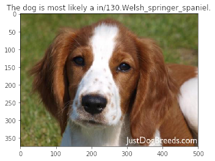

# **Classificando Raças de Cachorro com uma CNN**
Esta é minha implementação do projeto de curso **CNN Project: Dog Breed Classifier**<br/>
Do Nanodegree Deep Learning da Udacity, 2° Projeto do Curso<br/>
`Deep Learning Project`<br/>


# Table of Contents

- [**Classificando Raças de Cachorro com uma CNN**](#classificando-raças-de-cachorro-com-uma-cnn)
- [Table of Contents](#table-of-contents)
- [Project Overview](#project-overview)
- [Project Assumptions](#project-assumptions)
- [Data Dictionary](#data-dictionary)
        - [dogs dataset](#dogs-dataset)
        - [human faces dataset](#human-faces-dataset)
- [Solution Planning](#solution-planning)
  - [Final Product](#final-product)
  - [Tech Stack](#tech-stack)
  - [Process and Methods](#process-and-methods)
- [Project Results](#project-results)
- [Conclusions](#conclusions)
- [References](#references)
- [Next Steps](#next-steps)

# Project Overview
Welcome to the Convolutional Neural Networks (CNN) project! In this project, you will learn how to build a pipeline to process real-world, user-supplied images. Given an image of a dog, your algorithm will identify an estimate of the canine’s breed. If supplied an image of a human, the code will identify the resembling dog breed.

Along with exploring state-of-the-art CNN models for classification, you will make important design decisions about the user experience for your app. Our goal is that by completing this lab, you understand the challenges involved in piecing together a series of models designed to perform various tasks in a data processing pipeline. Each model has its strengths and weaknesses, and engineering a real-world application often involves solving many problems without a perfect answer. Your imperfect solution will nonetheless create a fun user experience

# Project Assumptions
- Template inicial de código foi disponibilizado para o projeto, meu papel foi o de adicionar funcionalidades chave para completar o projeto.
- Seções que começam com '(IMPLEMENTATION)' ou '(ANSWER)' no cabeçalho, indicam que o bloco seguinte de código precisava de funcionalidades adicionais das quais eu provi.
- Assumimos que na imagem deverá conter nela um cachorro, gato ou humano.
- Eu estou assumindo que a imagem provida pelo usuário tenha uma resolução minimamente adequada.
- Existe um número finito de categorias que podem ser classificadas.
- Este projeto tem como objetivo por em teste os conhecimentos aprendidos na seção 'Redes Neurais Convolucionais' do Nanodegree Deep Learning da instituição Udacity.

# Data Dictionary
In this project a worked with 2 datasets. One with dog images and other with human faces, both were divided into 3 sub groups, one for `train`, `test` and `validate`. 

##### dogs dataset
- 133 total dog categories.
- 8351 total dog images.
- 6680 training dog images.
- 835 validation dog images.
- 836 test dog images.

##### human faces dataset
- 13233 total human images.

# Solution Planning
## Final Product
Develop an algorithm inside a notebook, that could be used in a mobile or web app, that receives an image input from the user, detects if there is any dog inside that picture, if yes: provides an estimate of the dog's breed. Otherwise, if no dog is detected in the image but a human face was detected, provide the most resembling dog breed related to that human face.

## Tech Stack
- Jupyter Notebook, VSCode
- Python, Pandas, Numpy
- Matplotlib
- Keras, Scikit-learn
- OpenCV

##  Process and Methods
I broke the notebok into separate steps, in order to easily grasp the whole picture of the project and quickly change between tasks.
* [Step 0](#step0): Import Datasets
  * METHOD: Extract a dataset of dog images with the use of the `load_files` function from the scikit-learn library.
    - `train_files`, `valid_files`, `test_files` - numpy arrays containing file paths to images
    - `train_targets`, `valid_targets`, `test_targets` - numpy arrays containing onehot-encoded classification labels 
    - `dog_names` - list of string-valued dog breed names for translating labels
* [Step 1](#step1): Detect Humans
  * METHOD: 
    * Import a human images dataset provided by Udacity.
    * Use OpenCV's implementation of [Haar feature-based cascade classifiers](http://docs.opencv.org/trunk/d7/d8b/tutorial_py_face_detection.html) as the model to detect human faces in images.
    * Convert the images to grayscale
    * Write a function that return `True` if a human face is detected, and `False` if the opposite.
* [Step 2](#step2): Detect Dogs
  * METHOD:
    * Convert the images to vectors
    * With Keras import the *ResNet-50* model to detect dos in the images.
    * Supply the model with te image's vector
    * Make prediction, return `True` if the return category number is one of the dogs category present in the ResNet-50 labels, return `False` otherwise.
* [Step 3](#step3): Create a CNN to Classify Dog Breeds (from Scratch)
  * METHOD:
    * Create from Scratch a Convolutional Neural Network that attain accuracy of at least 1%
    * Pre-process Data
    * Define model architecture
    * Compile the model
    * Train and test the model
    * Evaluate the model (**11% of accuracy**)
* [Step 4](#step4): Use a CNN to Classify Dog Breeds (using Transfer Learning)
  * METHOD:
    * Model architecture
    * Compile the model
    * Train and test the model
    * Evaluate the model (**40.55% accuracy**)
* [Step 5](#step5): Create a CNN to Classify Dog Breeds (using Transfer Learning)
  * Obtani bottleneck features from:
    * VGG-19
    * ResNet-50
    * Inception
    * Xception
  * Model Architecture
  * Compile the model
  * Train the model
  * Load the model with best validation loss
  * Test the model
  * Predict Dog Breed with the selected model (**86% accuracy**)
* [Step 6](#step6): Write your Algorithm
  * METHOD:
    ```Python
      ### TODO: Write your algorithm.
      ### Feel free to use as many code cells as needed.
      import matplotlib.image as mpimg
      import matplotlib.pyplot as plt

      def dog_breed_classifier(img_path):
          image = mpimg.imread(img_path)
          plt.imshow(image)
          
          if dog_detector(img_path):
              plt.title("The dog is most likely a %s." % predict_dog_breed(img_path))
          elif face_detector(img_path):
              plt.title("The human in the image most resembles a %s." % predict_dog_breed(img_path))
          else:
              print("Can't predict the breed. There is no dog or human in this picture!")
          
          plt.show()
    ```
* [Step 7](#step7): Test Your Algorithm
  * METHOD:
    * Results in the Project Results Section of this README

# Project Results




# Conclusions
I created about 3 different models, with a Baseline initially reaching 11% accuracy, with a simple deep neural network, and I progressed until creating a convolutional model that uses transfer learning to boost its performance, reaching an accuracy of 86% in my ratings. I was able to successfully create an entire ML pipeline where I started from solution planning, data acquisition, processing, data separation in training, testing and validation sets, performance evaluation of the models, and generating conclusions about them. As a result, the application can classify human faces in a photo, classify dogs in a photo, and tell each of them which breed of dog they most resemble.

# References
- https://github.com/udacity/deep-learning

# Next Steps
- Create an interface for the user upload images
- Create an APP passing this algorithm as API